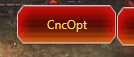
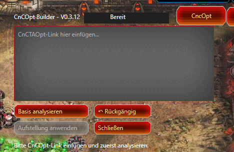
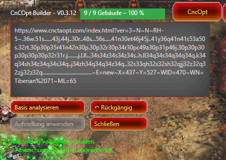

# CnC-TA CncOpt Builder - HE

> **Setzt ein CncOpt-Layout automatisch in der ausgewählten Basis um.**

Der **CnC-TA CncOpt Builder - HE** ist ein Tampermonkey-Script für  
**Command & Conquer: Tiberium Alliances**.

Mit dem Script kann ein mit **CncOpt** erstelltes Basis-Layout direkt auf die aktuell ausgewählte Basis übertragen werden.

---

## ✨ Funktionen

- 📋 CncOpt-Link direkt in das Script einfügen
- 🔎 Aktuelle Basis analysieren
- 🏗️ Vorhandene Gebäude automatisch dem CncOpt-Layout zuordnen
- 📐 Gebäude entsprechend dem Ziel-Layout verschieben
- 🔄 **Rückgängig-Funktion** für die letzte Layout-Änderung
- 📊 Fortschrittsanzeige während der Umsetzung
- 🛡️ Das aktuelle Layout wird vor jeder neuen Anwendung automatisch als Undo-Punkt gespeichert
- 👁️ Das CncOpt-Fenster wird nur im **Gebäudemodus** angezeigt
- ⚡ Keine manuelle Speicherung des aktuellen Layouts erforderlich

---

## 🖥️ Oberfläche

Das Script stellt sich direkt im Gebäudemodus von C&C Tiberium Alliances zur Verfügung.

### CncOpt-Link einfügen

Den von CncOpt erzeugten Link einfach in das Eingabefeld einfügen.

---

### 🔍 Basis analysieren

Mit **„Basis analysieren“** wird zunächst geprüft, welche Gebäude sich aktuell in der Basis befinden und wie diese dem gewünschten CncOpt-Layout zugeordnet werden können.

Dabei werden unter anderem Gebäudeart und Gebäudestufe berücksichtigt.

---

### 🏗️ Aufstellung anwenden

Nach erfolgreicher Analyse kann die neue Aufstellung mit **„Aufstellung anwenden“** umgesetzt werden.

Das Script verschiebt die vorhandenen Gebäude entsprechend der ermittelten Zielpositionen.

Während der Umsetzung zeigt die Fortschrittsanzeige den aktuellen Stand an.

---

## 🔄 Rückgängig

Vor jeder neuen Anwendung eines CncOpt-Layouts wird die **aktuelle Gebäudeaufstellung automatisch gespeichert**.

Dadurch kann die letzte Änderung jederzeit mit:

**↶ Rückgängig**

wiederhergestellt werden.

Es ist **kein vorheriges manuelles Speichern** erforderlich.

> Der Undo-Speicher enthält immer die Gebäudeaufstellung unmittelbar vor der letzten Anwendung eines CncOpt-Layouts.

---

## 📋 Verwendung

### 1. Basis öffnen

Öffne die Basis, in der das gewünschte Layout umgesetzt werden soll.

### 2. Gebäudemodus öffnen

Wechsle in den Gebäudemodus.

Das **CncOpt Builder**-Fenster wird automatisch eingeblendet.

### 3. CncOpt-Link einfügen

Kopiere den gewünschten CncOpt-Link und füge ihn in das Eingabefeld ein.

### 4. Basis analysieren

Klicke auf:

**Basis analysieren**

Das Script ermittelt nun die benötigten Gebäude und die jeweiligen Zielpositionen.

### 5. Aufstellung anwenden

Wenn die Analyse erfolgreich abgeschlossen wurde, kann die neue Aufstellung mit:

**Aufstellung anwenden**

übernommen werden.

### 6. Änderung rückgängig machen

Falls das Ergebnis nicht gewünscht ist, kann mit:

**↶ Rückgängig**

die vorherige Gebäudeaufstellung wiederhergestellt werden.

---

## ⚠️ Hinweise

- Das Script arbeitet mit den **bereits vorhandenen Gebäuden** der ausgewählten Basis.
- Es werden keine fehlenden Gebäude automatisch gebaut.
- Das gewünschte CncOpt-Layout sollte zur vorhandenen Basis passen.
- Die **Rückgängig-Funktion bezieht sich ausschließlich auf die letzte angewendete CncOpt-Aufstellung**.
- Beim Verlassen des Gebäudemodus wird das CncOpt-Fenster automatisch ausgeblendet.

---

## 📦 Installation

Das Script ist für **Tampermonkey** vorgesehen.

### Manuelle Installation

1. Tampermonkey installieren.
2. Das Script `CnC-TA_CncOpt_Builder-HE.user.js` öffnen.
3. Tampermonkey übernimmt die Installation.
4. C&C Tiberium Alliances neu laden.
5. Eine Basis öffnen und in den Gebäudemodus wechseln.

### Automatische Updates

Das Script enthält eine `@downloadURL` und `@updateURL`.

Damit kann Tampermonkey nach neuen Versionen suchen und das Script automatisch aktualisieren.

---

## 🔗 Projekt

**GitHub Repository:**

[Harzi66 / CnC-TA_CncOpt-Builder-HE](https://github.com/Harzi66/CnC-TA_CncOpt-Builder-HE)

---

## 🛠️ Technischer Hintergrund

Der CncOpt Builder ist als **Tampermonkey UserScript** für C&C Tiberium Alliances entwickelt.

Das Script nutzt die vorhandenen Spielmechanismen, um die Gebäude innerhalb der Basis an die durch CncOpt vorgegebenen Positionen zu verschieben.

Dabei wird zunächst die aktuelle Gebäudeaufstellung analysiert und anschließend mit dem gewünschten Layout verglichen.

---

## ❤️ Projekt

Der CnC-TA CncOpt Builder - HE ist Teil der **Harzi's C&C TA Script**-Projekte.

**Von Spielern für Spieler.**

Viel Spaß beim Optimieren eurer Basen! 🚀
